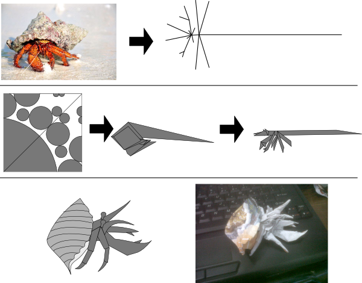
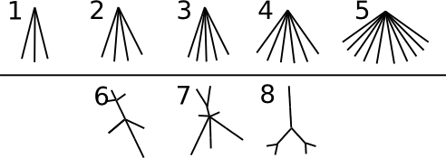

# Origami Design

Origami design can be more mathematical than you imagine. This time we will focus on origami design
according to Robert J. Lang. Look at the following picture.



First, a model that wanted to be folded into is made its stick-figure model. Notice that the
stick-figure forms a tree structure. Then the stick figure is projected to a piece of paper
according to some rules. After projected, this paper is folded according to those rules, then a
structure is formed according to the designed stick figure. Lastly, fold according to your artistic
taste.

In this problem, you will be given a weighted unrooted tree with $N$ nodes. Nodes are numbered from
$1$ to $N$. Let $L$ be the set of all $i$, where the $i$-th node is the leaf node. You must map
every leaf node $i$ to a point on a square area. Two leaf nodes may be mapped to the same point.
More precisely:

> For every $i$, which is the element of $L$, represents the $i$-th node as a point $P_i$ on
  $(x_i, y_i)$ with $0 \le x_i, y_i \le 1$

After every leaf node is mapped to a point, you can calculate the efficiency of that configuration.
Let $l\_{ij}$ be the distance from leaf node $i$ to leaf node $j$ on the given tree. The efficiency
point of the design is $m$, with:
$$m = \min_{i, j \in L \atop i \neq j} \frac{||P\_i - P\_j||}{l\_{ij}}$$

The formula can be interpreted as follow: for every leaf node pair, compute the Euclidean distance
between their representative points then divide by $l_{ij}$. The smallest value obtained is the
value of $m$.

The larger the value of $m$, the more efficient your design is. Your task is to maximize this
value!

## Implementation Details

This is an output-only task with partial scoring. You are given $8$ input files. For each input
file you should submit an output file with a mapping of the given leaf nodes to points. For each
output file you will get points based on the efficiency of your design.

You are not supposed to submit any source code for this task.

## Input Format

Each input file describes a weighted unrooted tree. The format is as follows:

* line $1$: $N$
* line $2 + i$ ($0 \le i \le N - 2$): three integers $u_i$, $v_i$, and $w_i$, which means the
  $i$-th edge connects node $u_i$ and node $v_i$ with weight $w_i$

## Output Format

Let $|L|$ be the number of leaf nodes in the input. Each output file is in the following format:

* line $1 + i$ ($0 \le i \le |L| - 1$): three integers $j$, $x_j$, and $y_j$, with the following
  meaning:
  * $j$ denotes the leaf node number (corresponds to the input),
  * $(x_j, y_j)$ denotes the point coordinate as the representative of node $j$.

The leaf node numbers in the output file must be distinct.

## Example

Consider the following input:

```
4
1 2 1
1 3 1
1 4 1
```

a possible valid output is:

```
2 1 0
3 0 1
4 0 0.5
```

The efficiency of the given sample is $0.25$.

## Constraints

* $3 \le N \le 12$
* $1 \le u_i, v_i \le N$ (for all $0 \le i \le N - 2$)
* $1 \le w_i \le 4$ (for all $0 \le i \le N - 2$)
* The given edges form a tree.

## Scoring

If your output for a test case is not valid, your score for that test case will be $0$. Otherwise,
the score that you obtain depends on the value $f$ which varies by testcase. For each test case, if
$e$ denotes the efficiency that you obtained, then the score will be
$\min(12.5, 12.5 \times e / f)$.

To give you some visualization, the following are all the eight trees from every test case. The
length of the edges on each tree are proportional to their weights.



The following are the value of $f$ for each test case:

| Test Case | $f$        |
| --------- | ---------- |
| 1         | 0.517632   |
| 2         | 0.5        |
| 3         | 0.353553   |
| 4         | 0.300463   |
| 5         | 0.210628   |
| 6         | 0.144815   |
| 7         | 0.0957     |
| 8         | 0.143613   |
